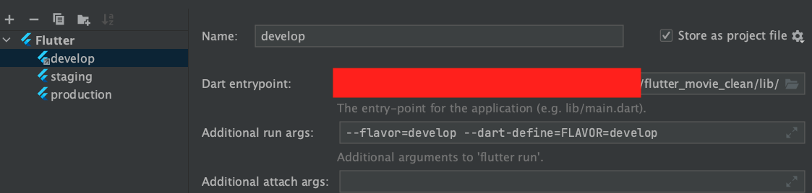

## Marvel

A sample Flutter application follow clean architecture

## Getting Started

### Generate resources

Run the commands below:

- Generate images, colors: `dart run build_runner build --delete-conflicting-outputs`
- Generate strings: `flutter pub get`

### Build & Run app

- In `Xcode` or `Visual Studio Code`, just select flavor and run.
- In `Android Studio`:

  - File > Open > select `flutter_movie_clean` folder (do not use import project)
  - Edit Configurations > Add New > Flutter > enter `develop/staging/production` (corresponding the flavors).
  - Add `--flavor=develop --dart-define=FLAVOR=develop` to `Additional run args` like below

    

  - Select and Run your flavor.

## Collaborating

- Run `prepare.sh`
- Add code
- Commit and create PR

## Credit

- [App Design, Thanks to **Divyanshu Jain**](<https://www.figma.com/file/yPCg7Z9PqmaplQOrmednNm/MARVEL--Streaming-App-(Community)?type=design&node-id=8-149&mode=design&t=bZRsa6D46iGVGSYA-0>)
- [Project Link](https://github.com/users/namnh-0652/projects/3)
